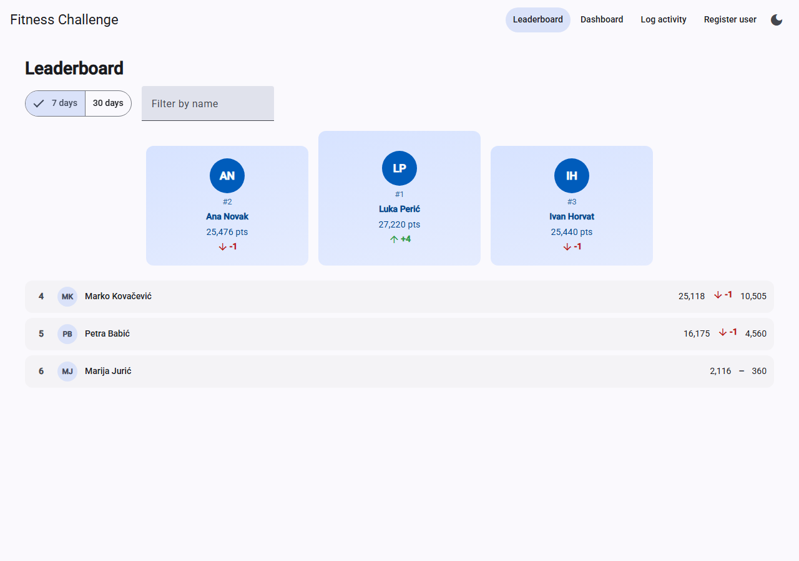
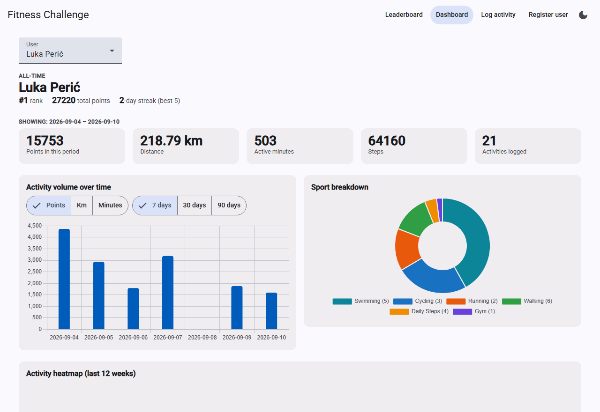
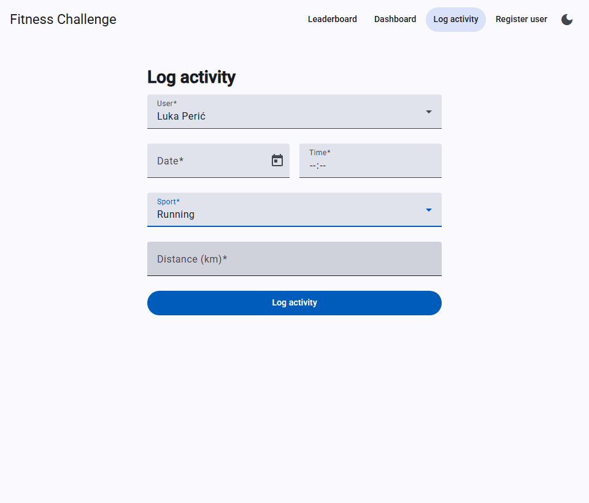

# Fitness Challenge

A full-stack app that gamifies physical activity: activities across six sports are normalized into a
single **Points** metric for one global leaderboard, plus a personal dashboard with charts. The
backend is ASP.NET Core (.NET 8, controllers) with EF Core, SQLite, and FluentValidation; the
frontend is Angular 22 (standalone components, current control-flow syntax) with Angular Material and
Chart.js via ng2-charts. Backend tests are xUnit, frontend tests are Vitest.

## Quick start

You need three things installed:

| Tool | Version | Notes |
|---|---|---|
| .NET SDK | 8.0 or newer | developed on 8.0.303 — check with `dotnet --list-sdks` |
| Node.js | `^22.22.3`, `^24.15.0` or `>=26` | developed on 24.19.0 — check with `node --version`; npm ships with it |
| Angular CLI | 22 | installed locally by `npm install`; no global install needed |

Then, from the repository root, run the backend and the frontend in two terminals.

### 1. Backend

```powershell
cd backend
dotnet restore
dotnet run --project FitnessChallenge.Api
```

Leave it running. The API is at <http://localhost:5080> and Swagger UI is at
<http://localhost:5080/swagger>. On the first run it creates and seeds a SQLite database
(`backend/FitnessChallenge.Api/fitness.db` — delete that file to reseed). It serves plain HTTP on
purpose: no dev certificate to trust, so it behaves identically on every OS. CORS is open to
`http://localhost:4200`.

### 2. Frontend

In a second terminal, again from the repository root:

```powershell
cd frontend/fitness-challenge-web
npm install
npm start
```

Open <http://localhost:4200>. The dev server proxies `/api/*` to the backend on port 5080, so the
backend must be running first.

### Tests

```powershell
dotnet test backend/FitnessChallenge.sln          # backend — xUnit (113 tests)

cd frontend/fitness-challenge-web
npm test                                          # frontend — Vitest (51 tests)
npm run lint
```

## Screenshots







## How it works

Six sport types, each scored on the one metric that fits it, all floored to a whole number and stored
on the activity row at ingestion.

### Scoring

| Activity | Rate | Formula |
|---|---|---|
| Running | 100 pts / km | `floor(distanceKm × 100)` |
| Walking | 50 pts / km | `floor(distanceKm × 50)` |
| Cycling | 25 pts / km | `floor(distanceKm × 25)` |
| Swimming | 15 pts / min | `(durationSeconds / 60) × 15` — completed minutes only |
| Gym | 5 pts / min | `(durationSeconds / 60) × 5` — completed minutes only |
| Daily Steps | 1 pt / 100 steps | `steps / 100` — integer division |

Worked examples (all covered by `ScoringServiceTests`): 1.55 km walking → `77.5` → **77** ·
`1:55` in the gym (115 s → 1 completed minute) → **5** · 399 steps → **3** ·
42.195 km running → `4219.5` → **4219**.

### Validation

Every invalid combination returns **400 Bad Request**. Each sport accepts exactly one metric:

| `sport` | Required | Must be absent |
|---|---|---|
| `running`, `walking`, `cycling` | `distance` (km, decimal, `≥ 0`) | `duration`, `steps` |
| `gym`, `swimming` | `duration` (`mm:ss`, matching `^\d{1,4}:[0-5]\d$`) | `distance`, `steps` |
| *(omitted)* → Daily Steps | `steps` (integer, `≥ 0`) | `distance`, `duration` |

A zero metric (`distance: 0`, `steps: 0`, `duration: "0:00"`) is accepted and scores 0 points; only a
negative `distance` or `steps` is rejected.

Also rejected: an unknown `sport` value; `datetime` missing or not ISO 8601; `datetime` more than
24 hours in the future; `userId` missing, blank, not a GUID, or not an existing user; a payload with
no metric at all; the wrong metric for the sport (the assignment's own `swimming` + `distance`
example); any extra metric alongside the correct one; a `duration` that fails the regex; a `duration`
on a distance sport; an empty body; malformed JSON.

One rule here is a design decision of ours, not something the assignment states: a **second Daily
Steps entry for the same user on the same UTC calendar day** is rejected. See
[docs/DESIGN.md](docs/DESIGN.md) for the reasoning and the timezone caveat.

## Design notes and API reference

The full API reference (every endpoint with curl examples and response shapes), the seed data model,
the reasoning behind each design decision — `decimal` over `double`, UTC day boundaries, all-time vs
windowed dashboard fields, 409 for duplicate names, and the rest — and two known limitations are in
**[docs/DESIGN.md](docs/DESIGN.md)**.
